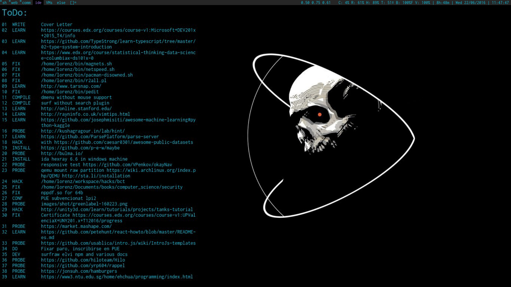

# tiny/turbo/throttling dwm status bar 

Run in linux kernel 4.0.7

## Install
```
$ git clone https://github.com/botika/tdwmstatus.git
$ cd tdwmstatus
$ make 
# make install
```
## Shot


## Description
Simple status bar for dwm. 
Return in order:
- loadavg
- percentage use 
  - cpu 
  - ram 
  - /home
- cpu temp
- percentage battery 
- battery status 
- volume
- uptime 
- date

For more info http://dwm.suckless.org/dwmstatus/
